# Skin Lesion Classification
This repository contains the code for skin lesion classification on the [ISIC 2019 Skin Lesion images for classification](https://www.kaggle.com/datasets/salviohexia/isic-2019-skin-lesion-images-for-classification/data). 

## 1. Multiclass Classification 
First, a multiclass classification on the task in performed with 8 classes - 'MEL', 'SCC', 'VASC', 'AK', 'NV', 'BKL', 'DF', 'BCC'. The notebook can be found in `skin_lesion_mul.ipynb`. We do some initial data exploration to view the samples:

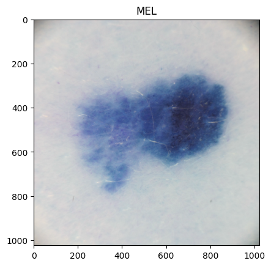 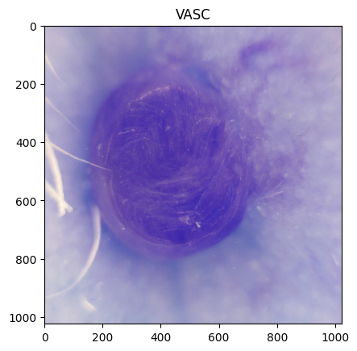 

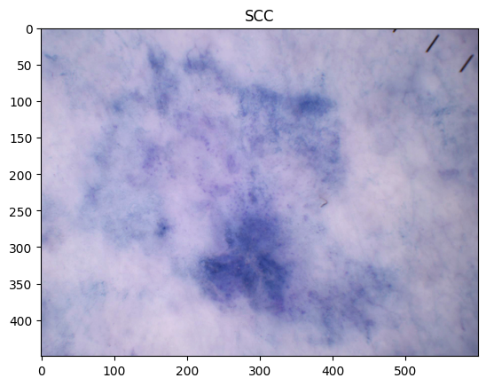 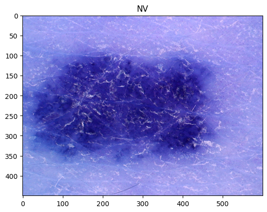

We use a pre-trained VGG16 architecture for the classification task. We finetune the model on the skin lesion data for 5 epochs. 

We get the following performance with this experiment:

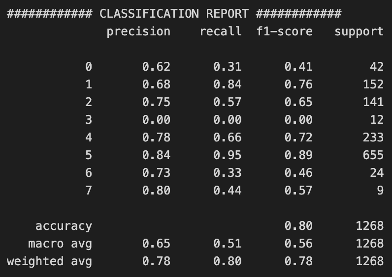

Here's the confusion matrix:

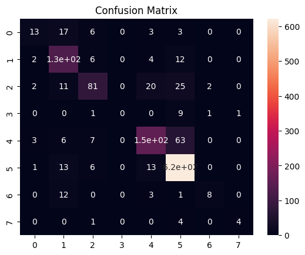

## 2. Binary Classification
Second, we perform a binary classification task where 'SCC' and 'VASC' are treated as 'Non-tumour' (marked as `NT` in the notebook) category and the rest are 'Tumour' (marked as T in the notebook) category. The notebooks can be found in `skin_lesion_bin.ipynb` and `skin_lesion_bin_oversample.ipynb` (2 separate notebooks were made only to facilitate parallel GPU training). Some initial data exploration shows that there is a huge imbalance in the data as shown below:

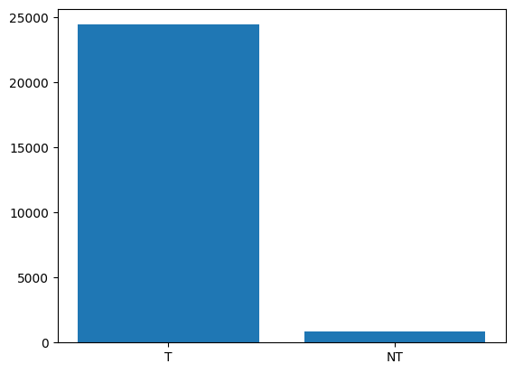

We do an initial experiment with a conventional cross-entropy loss and find that although the majority class performs very well(with 95% F1 score), the minority class only achieves 33% F1 score. A detailed performance is presented below:

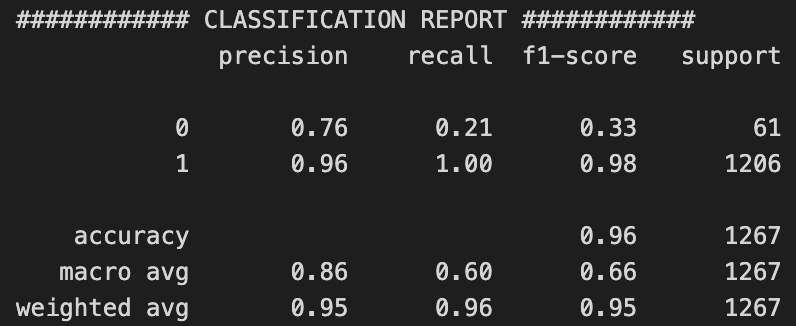

[NOTE]: In all the experiments with binary classification, the recall values of the `NT` and `T` classes represent the **specificity** and **sensitivity** respectively.  

The confusion matrix:

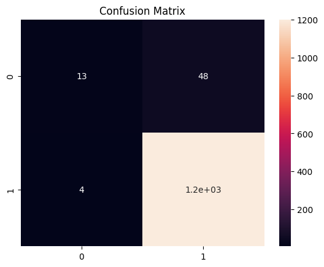

Thus, to improve the performance we test 2 strategies here:
- Oversampling: Here we oversample the data using several techniques like:
    - Rotation(0, 10, 350, 355 degrees)
    - Vertical flipping
    - Horizontal flipping
    - Translation
    - Adding Gaussian noise 
    The class distribution improves 8-fold as in:
    
    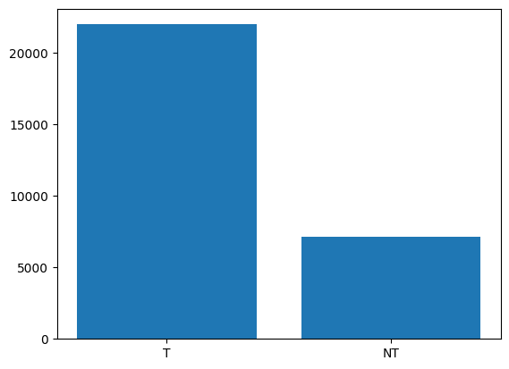
    
    We find that training the model on the oversampled data does improve the performance of the model, especially boosting the performance on the minority class(`NT`).
- Class-weighted loss: Next, we try a weighted loss based on the distribution of samples between the 2 classes. In brief, since the minority class has lesser no. of samples, the model will be penalized more if it makes a wrong prediction on the minority class. Similarly, if it gives correct prediction on the minority class, it will be rewarded more than the majority class. With this strategy, we find the performance of the model improves greatly compared to the initial vanilla model and relatively slightly as compared to the oversampling strategy. A detailed performance is presented below:

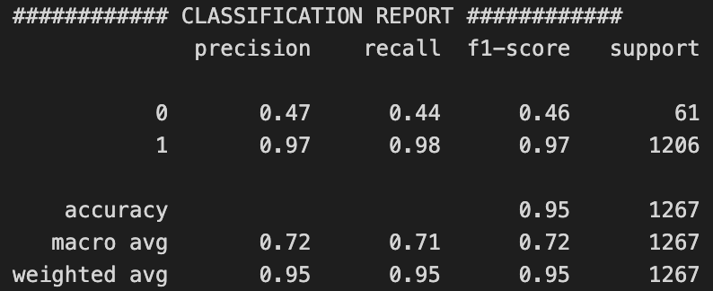

The confusion matrix:

### Discussion
We observe that this data is challenging becuase of the major data imbalance problem that it has. We mainly tried 2 options to counter that - oversampling and class-weighted loss. However, solving class-imbalance is still an open problem and further methods like using synthetic data, undersampling majority classes, "data mixup", etc. can be some tricks to improve performance of the CNN model.  

## 3. Explainability
We visualize one of the intermediate layers(# 24) of the CNN to check the feature maps. The result is plotted below:

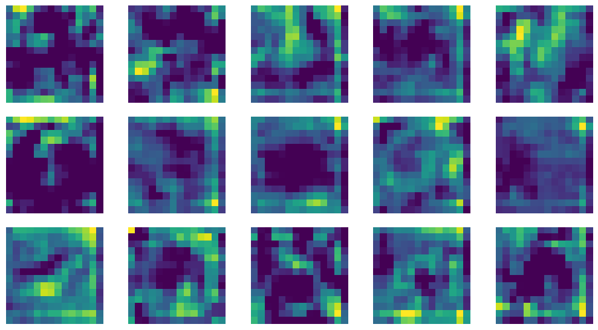

We use SHAP to discover the regions where the CNN model is attending to make a prediction on an input image. The SHAP results are presented as:

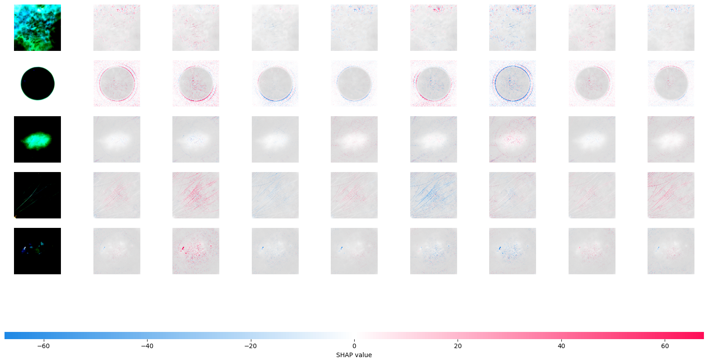
